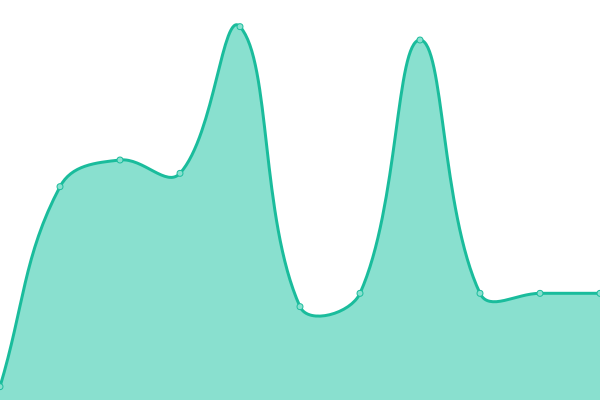
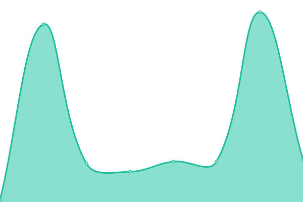

# [📈 Live Status](https://upptime.github.io/upptime): <!--live status--> **🟧 Partial outage**

This repository contains the open-source uptime monitor and status page for [Upptime](https://upptime.js.org), powered by [Upptime](https://github.com/upptime/upptime).

With [Upptime](https://upptime.js.org), you can get your own unlimited and free uptime monitor and status page, powered entirely by a GitHub repository. We use [Issues](https://github.com/upptime/upptime/issues) as incident reports, [Actions](https://github.com/upptime/upptime/actions) as uptime monitors, and [Pages](https://upptime.github.io/upptime) for the status page.

<!--start: status pages-->
<!-- This summary is generated by Upptime (https://github.com/upptime/upptime) -->
<!-- Do not edit this manually, your changes will be overwritten -->
<!-- prettier-ignore -->
| URL | Status | History | Response Time | Uptime |
| --- | ------ | ------- | ------------- | ------ |
|  [Google](https://www.google.com) | 🟩 Up | [google.yml](https://github.com/haupas/uptime-monitor/commits/HEAD/history/google.yml) | 

 75ms
     
 | 

<a href="https://status.unehre.de/history/google">100.00%</a>
    

|  Mail Server | 🟩 Up | [mail-server.yml](https://github.com/haupas/uptime-monitor/commits/HEAD/history/mail-server.yml) | 

 686ms
     
 | 

<a href="https://status.unehre.de/history/mail-server">100.00%</a>
    

|  WebMail Server | 🟩 Up | [web-mail-server.yml](https://github.com/haupas/uptime-monitor/commits/HEAD/history/web-mail-server.yml) | 

 235ms
     
 | 

<a href="https://status.unehre.de/history/web-mail-server">100.00%</a>
    

|  [Wikipedia](https://en.wikipedia.org) | 🟩 Up | [wikipedia.yml](https://github.com/haupas/uptime-monitor/commits/HEAD/history/wikipedia.yml) | 

 197ms
     
 | 

<a href="https://status.unehre.de/history/wikipedia">99.95%</a>
    

|  CDN Server | 🟩 Up | [cdn-server.yml](https://github.com/haupas/uptime-monitor/commits/HEAD/history/cdn-server.yml) | 

 508ms
     
 | 

<a href="https://status.unehre.de/history/cdn-server">16.16%</a>
    

|  Soundboard Server | 🟩 Up | [soundboard-server.yml](https://github.com/haupas/uptime-monitor/commits/HEAD/history/soundboard-server.yml) | 

 534ms
     
 | 

<a href="https://status.unehre.de/history/soundboard-server">100.00%</a>
    

|  Statistik Server | 🟩 Up | [statistik-server.yml](https://github.com/haupas/uptime-monitor/commits/HEAD/history/statistik-server.yml) | 

 483ms
     
 | 

<a href="https://status.unehre.de/history/statistik-server">100.00%</a>
    

|  [Broken Site](https://thissitedoesnotexist.com) | 🟥 Down | [broken-site.yml](https://github.com/haupas/uptime-monitor/commits/HEAD/history/broken-site.yml) | 

 0ms
     
 | 

<a href="https://status.unehre.de/history/broken-site">100.00%</a>
    

|  [Test for HEAD](https://www.google.com) | 🟩 Up | [test-for-head.yml](https://github.com/haupas/uptime-monitor/commits/HEAD/history/test-for-head.yml) | 

 16ms
     
 | 

<a href="https://status.unehre.de/history/test-for-head">100.00%</a>
    

|  Secret Site | 🟥 Down | [secret-site.yml](https://github.com/haupas/uptime-monitor/commits/HEAD/history/secret-site.yml) | 

 0ms
     
 | 

<a href="https://status.unehre.de/history/secret-site">68.73%</a>
    

<!--end: status pages-->

[**Visit our status website →**](https://upptime.github.io/upptime)

## 📄 License

- Powered by: [Upptime](https://github.com/upptime/upptime)
- Code: [MIT](./LICENSE) © [Upptime](https://upptime.js.org)
- Data in the `./history` directory: [Open Database License](https://opendatacommons.org/licenses/odbl/1-0/)
